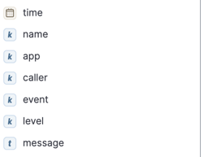
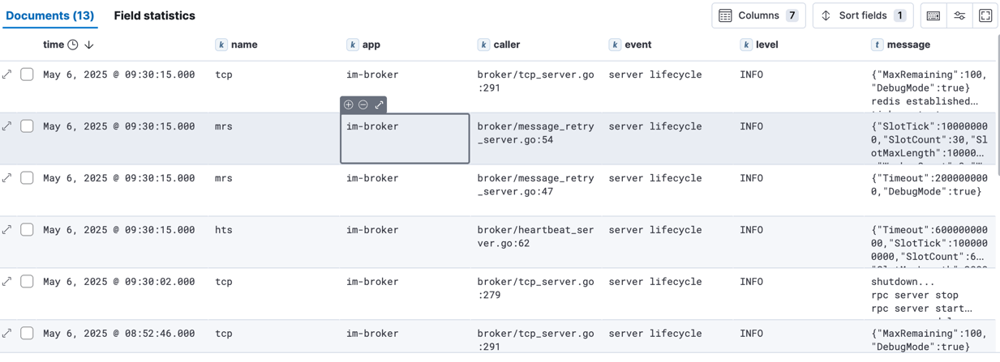

# im

## 代码生成
```shell
$ cd src/api

// 单独生成packet
$ protoc --go_out=. --go_opt=paths=source_relative --go-grpc_out=. --go-grpc_opt=paths=source_relative packet.proto

// packet 和 kitex一起生成
$ kitex broker.ptoto
$ kitex business.proto
$ kitex router.proto

```

## Starting on IDE
### build
```shell
go mod tidy
```

```shell
cd client
go mod tidy
```

### Start MysQL Redis Etcd and Kafka
```shell
docker compose up -d
```
### Start im-broker
```shell
go run im-broker.go
```

## Start client
```shell
cd client
go run im-client.go
```


## Kibana
docker exec -it elasticsearch /bin/bash
cd /usr/share/elasticsearch
./bin/elasticsearch-service-tokens create elastic/kibana kibana-docker-token
## 复制token到 docker-compose中ELASTICSEARCH_SERVICEACCOUNTTOKEN=xxx


curl -u elastic:elastic -X GET "localhost:9200/logstash-*/_search?pretty&q=*&size=5"


## 关于ELK
### DataView
im-logs-*
### 可用fields

### 示例
